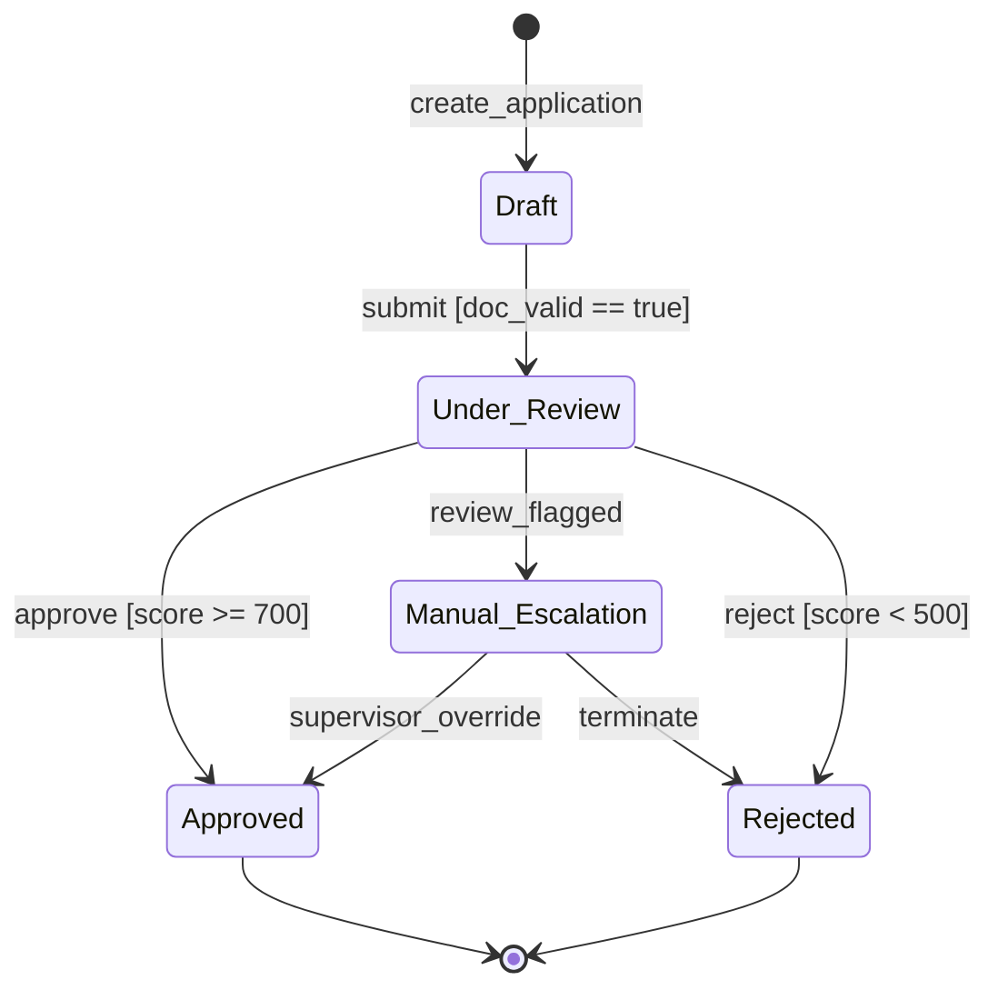

# ⚡ SmartFlow Verify

> **Formal Verification, Model Checking & Finite State Machine Analysis for Enterprise Workflows**

SmartFlow Verify is an interactive, browser-based formal verification platform designed to model, analyze, and verify complex business workflows and state machines. It bridges practical software engineering and enterprise process orchestration with foundational principles from the **Theory of Computation (TOC)**, **Automata Theory**, and **Formal Methods**.

---

## 📚 Deep Connection to Theory of Computation (TOC)

At its core, **SmartFlow Verify** translates business workflows into formal mathematical automata and applies classical theoretical computer science algorithms for safety, reachability, determinism, and temporal logic verification.

```
       Formal 5-Tuple Definition: M = (Q, Σ, δ, q₀, F)
  ┌─────────────────────────────────────────────────────────┐
  │  Q   : Finite set of states (Initial, Review, Terminal) │
  │  Σ   : Input alphabet of events / trigger actions       │
  │  δ   : Transition function (Q × Σ → Q) with guards      │
  │  q₀  : Unique start state (q₀ ∈ Q)                      │
  │  F   : Set of accepting / terminal states (F ⊆ Q)       │
  └─────────────────────────────────────────────────────────┘
```

### 1. Finite Automata Formalism `M = (Q, Σ, δ, q₀, F)`
Every workflow created or imported in SmartFlow Verify is modeled as a formal **Deterministic / Non-Deterministic Finite State Machine (FSM)**:



- **States (`Q`)**: The discrete stages of a process (e.g., `Draft`, `Under_Review`, `Approved`, `Rejected`).
- **Alphabet (`Σ`)**: The set of valid discrete input symbols/events triggering state transitions (e.g., `submit`, `approve`, `reject`, `timeout`).
- **Transition Function (`δ`)**: A mapping `δ: Q × Σ → Q`, augmented with guard predicates `g: Env → {true, false}` and effect actions.
- **Initial State (`q₀ ∈ Q`)**: The designated root state where computation begins.
- **Terminal States (`F ⊆ Q`)**: The set of final accepting (`F_success`) and rejecting (`F_failure`) states.

---

### 2. Theoretical Verification Checks & Algorithms

| TOC / Formal Concept | Mathematical Formulation | Theoretical Significance |
| :--- | :--- | :--- |
| **Reachability Analysis** | `Reach(q₀) = { q ∈ Q ∣ ∃ w ∈ Σ*, δ*(q₀, w) = q }` (Computed via BFS traversal) | Detects **Unreachable States / Dead Code** (`Q \ Reach(q₀)`) that can never be executed under any valid sequence of events. |
| **Deadlock Detection** | `∀ s ∈ Reach(q₀): (s ∉ F) ⟹ (deg⁺(s) > 0)` | Identifies non-terminal states with **zero outgoing transitions**, trapping execution indefinitely. |
| **Livelock & Trap Cycles** | `Pre*(F) = { q ∈ Q ∣ ∃ w ∈ Σ*, δ*(q, w) ∈ F }` (Computed via Reverse BFS) | Detects **infinite non-accepting cycles / closed trap components** where execution cycles forever without ever reaching any final state `F`. |
| **Determinism (DFA vs NFA)** | `∀ q ∈ Q, e ∈ Σ: count(δ(q, e)) ≤ 1` (or mutually exclusive guards) | Flags **Non-Deterministic choices** (ambiguous state transitions) and enforces deterministic execution. |
| **Counter-Example Trace** | Shortest path reconstruction `w = e₁ e₂ ... eₖ ∈ Σ*` via `parentMap[v]` | When a formal violation is detected, synthesizes the exact shortest event trace triggering the defect. |
| **State Transition Matrix** | 2D matrix mapping `δ: Q × Σ → Q ∪ {∅}` | Tabular algebraic representation of the state transition function. |

---

### 3. Model Checking & Temporal Logic (CTL / LTL)

SmartFlow Verify incorporates automated model checking for temporal specifications:

- **Safety Properties (`AG ¬Hazard`)**: Ensures that the system never enters an invalid or prohibited state in any execution branch.
- **Liveness Properties (`AG (Request → AF Response)`)**: Guarantees that every request eventually receives a valid resolution.
- **Precedence Constraints (`A[¬Disburse U KYC_Verified]`)**: Formally verifies that prerequisite verification milestones strictly precede critical execution steps.
- **Separation of Duties (SoD)**: Enforces role invariants preventing identical actors from initiating and approving privileged transitions.

---

## ✨ Key Features

- 🎨 **Visual Canvas & Graph Editor**: Interactive canvas to drag, drop, connect, and configure states, guards, actions, and SLA parameters.
- 🔍 **Real-Time Verification Engine**: Instant evaluation of deadlocks, unreachable states, livelocks, non-determinism, and invariant compliance.
- ⚡ **Automated Counter-Example Paths**: Visualizes the step-by-step event trace leading to any detected failure.
- 🕹️ **Interactive Simulation Dock**: Step through transitions manually or run auto-simulations with variable state tracking and execution history.
- 📊 **State Matrix View**: Matrix representation of the state transition function `δ(q, a)` with density and branching factor metrics.
- 🤖 **AI Workflow Optimizer & Synthesis**: Powered by Gemini (`@google/genai`) to generate automated repair patches, optimize SLA bottlenecks, and resolve non-deterministic ambiguities.
- 📑 **Formal Verification Audit Reports**: Export comprehensive verification reports in JSON, Markdown, and print-ready formats.

---

## 🛠️ Tech Stack

- **Frontend**: React 19, TypeScript, Tailwind CSS, Motion (Framer Motion)
- **Icons & UI**: Lucide React
- **Backend / Dev Server**: Node.js, Express, TSX, Vite
- **AI Engine**: Google Gemini API (`@google/genai`)

---

## 🚀 Getting Started

### Prerequisites
- [Node.js](https://nodejs.org/) (version 18+ recommended)
- [npm](https://www.npmjs.com/) or [yarn](https://yarnpkg.com/)
- A Google Gemini API Key (optional, for AI optimization features)

### Installation

1. **Clone the repository**:
   ```bash
   git clone git@github.com:hackChinmay/smartflow-verify.git
   cd smartflow-verify
   ```

2. **Install dependencies**:
   ```bash
   npm install
   ```

3. **Configure Environment Variables**:
   Copy `.env.example` to `.env.local` and add your API key:
   ```bash
   cp .env.example .env.local
   ```
   Add your key in `.env.local`:
   ```env
   GEMINI_API_KEY=your_gemini_api_key_here
   ```

4. **Start the Development Server**:
   ```bash
   npm run dev
   ```
   Open [http://localhost:3000](http://localhost:3000) in your browser.

---

## 📁 Project Structure

```
smartflow-verify/
├── src/
│   ├── components/
│   │   ├── AiOptimizerModal.tsx     # AI-driven repair & optimization modal
│   │   ├── ExportReportModal.tsx    # Formal verification audit report export
│   │   ├── InvariantManager.tsx     # Temporal logic & business rule manager
│   │   ├── Navbar.tsx               # Header, preset selector & action triggers
│   │   ├── SimulationDock.tsx       # Step-by-step execution tracer & simulator
│   │   ├── StateMatrixView.tsx      # Tabular transition function δ(q, a)
│   │   ├── VerificationPanel.tsx    # Real-time verification issues & metrics
│   │   └── WorkflowCanvas.tsx       # Interactive FSM node-edge canvas
│   ├── data/
│   │   └── workflowTemplates.ts     # Pre-built industrial workflow benchmarks
│   ├── services/
│   │   └── fsmVerifier.ts           # Formal BFS, deadlock, livelock & CTL engine
│   ├── types/
│   │   └── fsm.ts                   # FSM formal types, issues, and invariants
│   ├── utils/
│   │   └── fsmLayout.ts             # Automatic graph layout algorithms
│   ├── App.tsx                      # Main application orchestrator
│   └── main.tsx                     # React root mount
├── server.ts                        # Local Express server with Vite middleware
├── package.json                     # Project scripts and dependencies
└── README.md                        # Project documentation & TOC theory guide
```

---

## 📜 License

This project is open source and available under the [MIT License](LICENSE).
